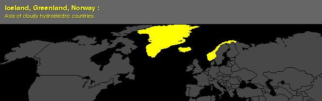
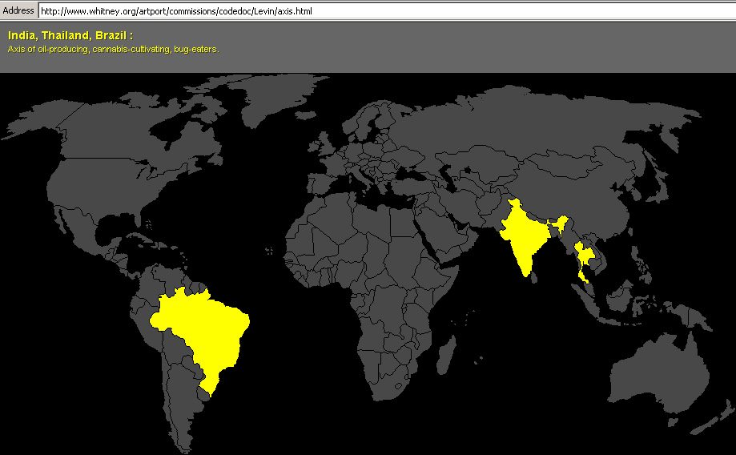
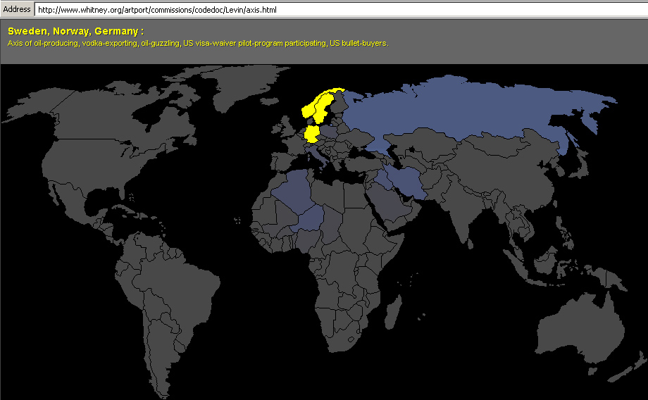

# Axis

By Golan Levin, 2002 (revised 2026)

**Axis** (2002: Golan Levin) is a whimsical interactive data visualization, commissioned by the Whitney Museum for its Artport website. A dozen artists were invited by curator Christiane Paul to respond to a specific assignment in a programming language of their choice. The assignment was to 'connect and move three points in space,' which obviously could be interpreted in a literal or abstract way. The code itself was not to exceed 8 kilobytes, which equals a fairly short text document. My contribution, **Axis**, is an interactive applet driven by a simple database of arcane sociopolitical factoids. The project responds to Paul's challenge by allowing its users to connect three countries into a conceptual "Axis" defined by their common properties in this database. **Axis** can be experienced interactively online [**here**](https://editor.p5js.org/golan/full/3xIyYPpVW).

---

### Implementations and Code

**Axis** was originally developed as a Java applet in 2002. In January 2026, it was ported to Processing version of Java, as well as the p5.js toolkit for JavaScript. The p5.js version can be experienced interactively in a browser [**here**](https://editor.p5js.org/golan/full/3xIyYPpVW).

* Original Java version (2002): [code](AxisApplet2002_java/AxisApplet.java)
* Restored Java version (Processing 4.x, 2026): [code](AxisApplet2026_processing/AxisApplet2026_processing.pde)
* JavaScript version (p5.js, 2026): [code](AxisApplet2026_p5js/sketch.js)
* p5.js (at editor.p5js.org, 2026): [code](https://editor.p5js.org/golan/sketches/3xIyYPpVW) • [**interactive**](https://editor.p5js.org/golan/full/3xIyYPpVW)
* p5.js (at OpenProcessing.org, 2026): [code](https://openprocessing.org/sketch/2858463)
* Code "highlights" (excerpts): [document](code_highlights.java)

---

### Artist's Statement

> "An Axis can't have more than three countries," explained Iraqi President Saddam Hussein. "This is not my rule, it's tradition. In World War II you had Germany, Italy, and Japan in the evil Axis. So you can only have three. And a secret handshake. Ours is wicked cool."1
> 
> President Bush's recent assertion that North Korea, Iraq and Iran form an "Axis of Evil"2 was more than a calculated political act — it was also an imaginatively formal, geometric one, which had the effect of erecting a monumental, virtual, globe-spanning triangle.
> 
> **Axis** is an online tool intended to broaden opportunities for similar kinds of Axis creation. It allows its participant to connect any three points in space [countries] into a new Axis of his or her own design. With the help of multidimensional statistical metrics culled from international public databases, the commonalities amongst the user's choices are revealed. In this manner, **Axis** presents an inversion of Bush's praxis, obtaining lexico-political meaning from the formal act of spatial selection.
> 
> **References**
> 
> 1. Marlatt, Andrew. "Angered by Snubbing, Libya, China, Syria Form 'Axis of Just as Evil'". [*SatireWire*, 1/30/2002](https://web.archive.org/web/20040211175804/https://www.satirewire.com/news/jan02/axis.shtml).
> 2. "In Speech, Bush Calls Iraq, Iran and North Korea 'Axis of Evil'". [*State of the Union Address*](https://georgewbush-whitehouse.archives.gov/news/releases/2002/01/20020129-11.html), 1/29/2002.

---

### Screenshots of *Axis*

Below are screenshots of **Axis** running online at Whitney Artport, circa 2002.

